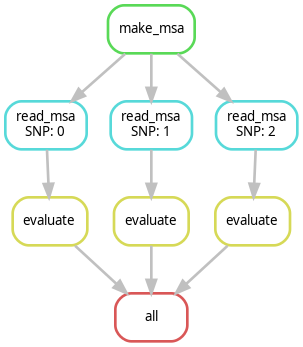

# SNP Annotator

This project uses Snakemake to manage and execute a workflow to annotate protein SNPs based on conservation and aminoacid type.\
The program will output a rating of every SNP between 1-10 where 1 means\
Neutral and 10 is equal to Deleterious for the resulting protein.\
The program will determine this from a given protein multifasta or an msa file (preferably containing 10 or more sequences).

## Requirements

-   [Python](https://www.python.org/) (\>=3.11)
-   [Snakemake](https://snakemake.readthedocs.io/) (\>=7.21)
-   [Clustal Omega](http://www.clustal.org/omega/) (\>= 1.2.4)

## Setup

1.  Clone and enter this repository:

``` bash
git clone https://github.com/jorick44/snper.git
```

``` bash
cd snakemake-project
```

2.  Edit the `config/config.yaml` file to customize the parameters required for your workflow. read the `config/README.md` for more information about

## Running the workflow

Once you made sure the `config/config.yaml` is set up correctly run the following command:

``` bash
snakemake --cores all --snakefile workflow/Snakefile.smk
```

> **Note** For more options, refer to the [Snakemake documentation](https://snakemake.readthedocs.io/).

Once it is done you will find the output in the result's directory.

This repository will contain example files to make it able to run the above code without issue.

### DAG



## Output

The output will be in the `results/out0.txt` (the number will represent every SNP) it will contain the SNP description, the rating as described in the above description and the conservation rate of the amino acid residue and types 1.0 is fully conserved 0 is no conservation.

## Author

For any questions email me at [j.baron\@st.hanze.nl](mailto:j.baron@st.hanze.nl){.email}
